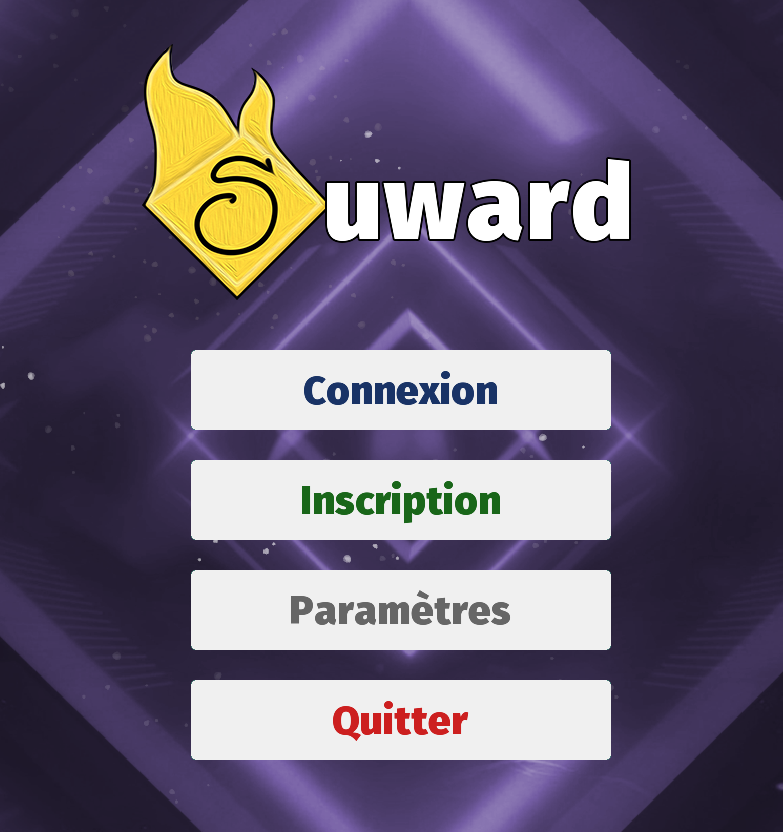
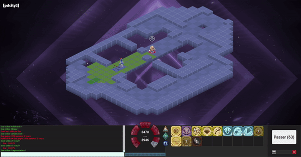
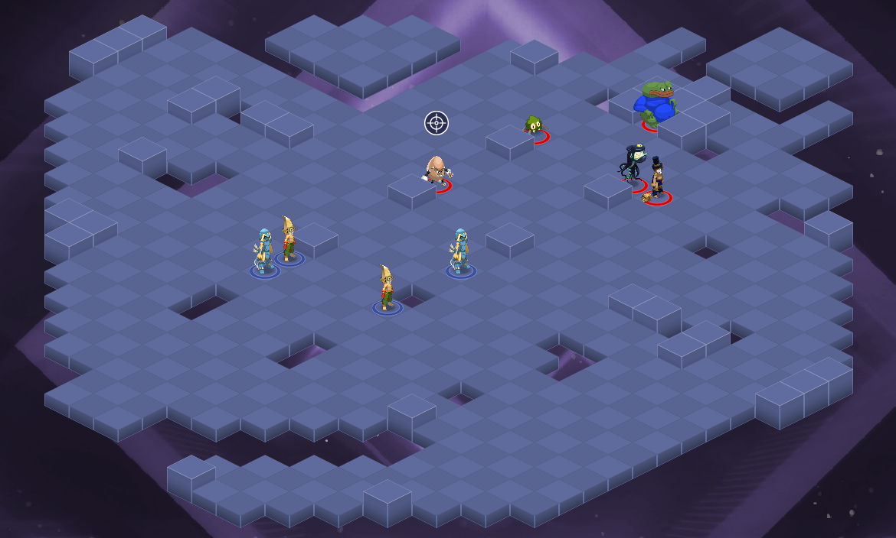
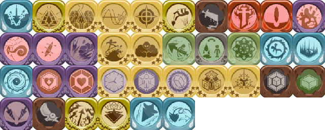

# **SUWARD**

Suward is a remake of [Dofus](dofus.fr) with [libGDX](libGDX.com) Java framework.
It uses KryNet library for server network. 

This took me over 300 hours of work.
There are a lot of things to change in the code, as it was an experience that taught me a lot.

## **Game screenshots**

## **Spells and status assets**

If you have any questions or ideas do not hesitate to contact me: [suward.games@gmail.com](suward.games@gmail.com) !

Most of the images are owned by Ankama games.